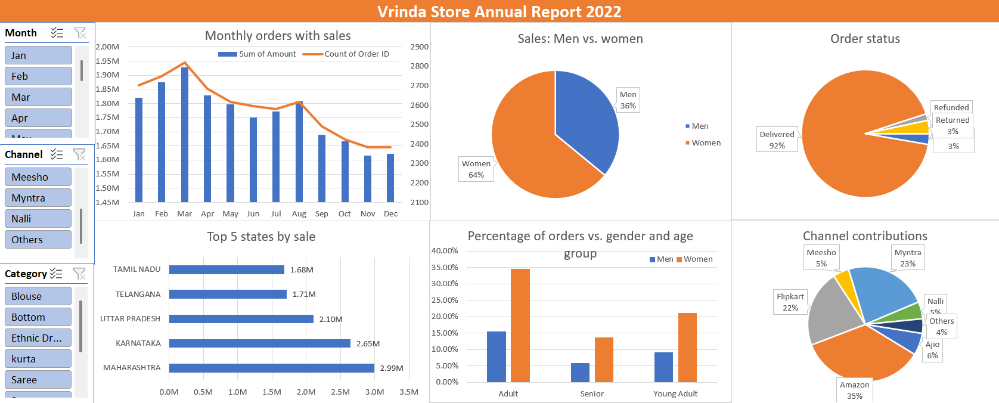

# 🛍️ Vrinda Store Sales Analysis Dashboard (Excel)

This project analyzes sales data from **Vrinda**, an online clothing store, using **Microsoft Excel**. The goal is to derive actionable insights from 2022 sales and order data to assist in data-driven marketing and product strategies. The final output is an **interactive dashboard** created using Excel's Pivot Tables, Charts, and Slicers.


---

## 📁 Project Structure

```{}
/data/
  01_raw_data.xlsx           # Raw data
  02_clean_data.xlsx         # Cleaned data
  03_processed_data.xlsx     # Processed data
/dashboard/
  vrinda_dashboard.xlsx      # Interactive pivot-based dashboard
README.md
dashboard_preview.png        # Screenshot of the dashboard
```

---

## 📌 Table of Contents

- [🛍️ Vrinda Store Sales Analysis Dashboard (Excel)](#️-vrinda-store-sales-analysis-dashboard-excel)
  - [📁 Project Structure](#-project-structure)
  - [📌 Table of Contents](#-table-of-contents)
  - [❓ Questions Answered](#-questions-answered)
  - [🧹 Data Cleaning](#-data-cleaning)
  - [🔧 Data Processing](#-data-processing)
    - [📊 Creating `Age Group`](#-creating-age-group)
    - [📆 Creating `Month`](#-creating-month)
  - [📈 Data Analysis](#-data-analysis)
    - [1. 📊 Monthly Sales vs Orders](#1--monthly-sales-vs-orders)
    - [2. 🚻 Gender-wise Sales](#2--gender-wise-sales)
    - [3. 📦 Order Status Breakdown](#3--order-status-breakdown)
    - [4. 📍 Top 5 States by Sales](#4--top-5-states-by-sales)
    - [5. 👥 Gender vs Age Group](#5--gender-vs-age-group)
    - [6. 🛒 Channel Contribution to Sales](#6--channel-contribution-to-sales)
  - [🖱️ Interactive Dashboard](#️-interactive-dashboard)
  - [🔍 Insights](#-insights)
  - [🎯 Final Recommendation](#-final-recommendation)
  - [💻 How to Use](#-how-to-use)
  - [📸 Dashboard Preview](#-dashboard-preview)
  - [📬 Contact](#-contact)

---

## ❓ Questions Answered

* **Which month had the highest sales and orders?**
* **Which gender purchased the most?**
* **What are the different types of order statuses?**
* **Which are the top 5 states contributing to sales?**
* **What's the relationship between age and gender for order counts?**
* **Which sales channel contributes the most to revenue?**
* **What is the highest selling category?**
* **Comparison of total sales and orders in a single visual.**

---

## 🧹 Data Cleaning

The dataset includes the following columns:

| Column         | Description                                 | Action Taken                        |
| -------------- | ------------------------------------------- | ----------------------------------- |
| `Gender`       | Gender values were inconsistent             | Mapped M/W → Men/Women              |
| `Qty`          | Quantity field had text entries             | Replaced "One"/"Two" → 1/2          |
| `currency`     | Only contained INR                          | Marked as redundant, can be dropped |
| `ship-country` | All values were "IND"                       | Marked as redundant, can be dropped |
| Others         | All other columns were clean and consistent | --                                  |

---

## 🔧 Data Processing

### 📊 Creating `Age Group`

Created a new column based on `Age` using binning logic:

```excel
=IF($E8>=50, "Senior", IF($E8>=30, "Adult", "Young Adult"))
```

Binning criteria:

- Age ≥ 50 → **Senior**
- 30 ≤ Age < 50 → **Adult**
- Age < 30 → **Young Adult**

---

### 📆 Creating `Month`

Extracted the month name from the `Date` column using:

```excel
=TEXT($G2, "mmm")
```

---

## 📈 Data Analysis

### 1. 📊 Monthly Sales vs Orders

- Created a pivot table with `Month` as the row label.
- Used a **bar-line combo chart** to compare sales and number of orders dynamically.

### 2. 🚻 Gender-wise Sales

- Used a pivot table to calculate sales per gender.
- Created a **pie chart** showing 64% of sales from women and 36% from men.

### 3. 📦 Order Status Breakdown

- Pivot table and pie chart used to visualize distribution across:
  - Delivered
  - Cancelled
  - Refunded
  - Returned

### 4. 📍 Top 5 States by Sales

- Dynamic pivot chart created to display the top 5 states.
- Updates automatically with slicers.

### 5. 👥 Gender vs Age Group

- Stacked bar chart showing number of orders split by `Age Group` and `Gender`.

### 6. 🛒 Channel Contribution to Sales

- Sales compared across `Ajio`, `Amazon`, `Flipkart`, `Meesho`, `Myntra`, `Naali`, `Others`.

---

## 🖱️ Interactive Dashboard

Made all pivot charts dynamic using **Slicers** for:

- `Month`
- `Category`
- `Channel`

Users can interactively slice and view results across multiple dimensions.

> ⚠️ Note: Excel file uses pivot charts with slicers. Please ensure macros and external links are disabled if security prompts appear when opening the file.

---

## 🔍 Insights

- 👩‍🦰 **Women** are more likely to make purchases compared to men.
- 🧾 **Adult age group (30-50)** accounts for the majority of orders.
- 🏙️ **Top states** by number of orders: Maharashtra, Karnataka, and Uttar Pradesh.
- 🛍️ **Top performing channels**: Amazon, Flipkart, Myntra.

---

## 🎯 Final Recommendation

> **Target women customers aged 30–50 residing in Maharashtra, Karnataka, and Uttar Pradesh. Focus marketing campaigns on Amazon, Flipkart, and Myntra using tailored offers, ads, and coupon codes.**

---

## 💻 How to Use

1. Clone or download the repository.
2. Open the file: `/dashboard/vrinda_dashboard.xlsx` in Excel (2016 or newer).
3. Use slicers to filter by month, category, and channel.
4. Charts will update dynamically with your selections.

---

## 📸 Dashboard Preview



---

## 📬 Contact

Feel free to reach out via [GitHub Issues](https://github.com/SushrutGaikwad/store-data-analysis/issues) for suggestions, feedback, or collaboration.

---
